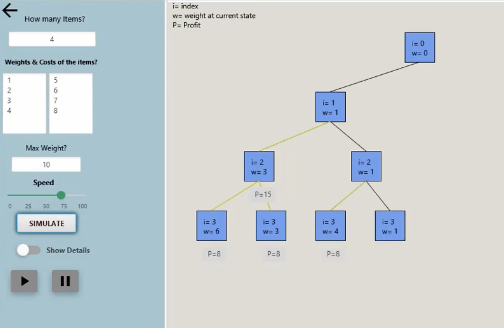

# Dynamic Programming Simulator

This is an object oriented programming project which can simulate six different types of dynamic programming based problems. The project was built using JavaFX in jdk 9.0.4 . It can simulate the following dynamic programming based problems by taking user input 
# Available Problems
* 0-1 Knapsack
* Coin Change
* Longest Increasing Subsequence
* Longest Common Subsequence
* Matrix Chain Multiplication
* Edit Distance
# Available Features
* Control the speed of the simulation
* Play/Pause the simulation
* Result of each state is shown right below the box representing the state
* Simulation details and details of the states in a new window
* Identify previously visited states
